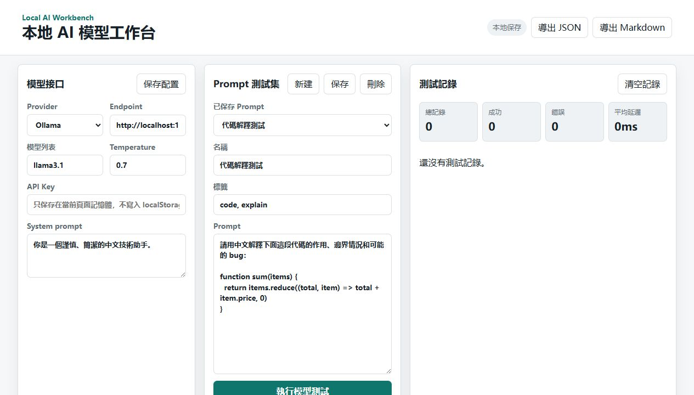
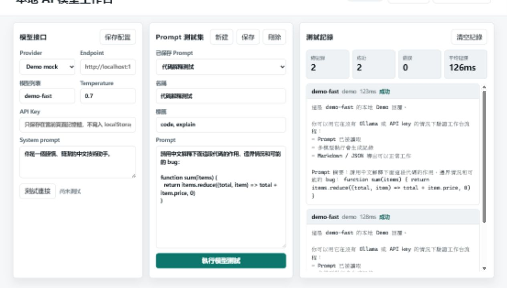

# Local AI Workbench

一個面向個人開發者和 AI 工具使用者的本地 AI 模型工作台，用來連接 Ollama、LM Studio 或 OpenAI 兼容 API，管理提示詞、對話記錄和模型測試。

> 狀態：MVP 開發中。當前版本是一個無外部依賴的本地 Web 工作台原型。

## 適合誰用

- 想在本機比較不同 LLM 模型效果的開發者
- 使用 Ollama / LM Studio / OpenAI 兼容 API 的 AI 工具玩家
- 想把 prompt、測試記錄和模型輸出整理起來的小團隊
- 想避免把所有實驗記錄散落在聊天窗口的人

## 解決什麼問題

很多本地模型工具能聊天，但不適合做「可重複的模型測試」。同一個 prompt 換模型後效果如何、哪次參數更好、某個任務的最佳模板是什麼，常常靠記憶和截圖保存。

Local AI Workbench 的方向是把這些操作變成可保存、可比較、可導出的工作流。

## 已有 MVP 功能

- Demo mock provider，沒有 Ollama / API key 也能跑通流程
- 連接本地或雲端的 OpenAI compatible API
- 支援 Ollama 常用接口配置
- Provider 連接測試
- 建立、保存、標記 prompt
- 對同一個 prompt 選擇不同模型執行
- 保存對話和模型輸出
- 導出 Markdown / JSON 測試記錄
- 提供本地優先的資料存儲策略
- API Key 只保存在當前頁面記憶體，不寫入 localStorage

## 暫不做

- 不做模型訓練平台
- 不做雲端帳號系統
- 不自動上傳對話記錄
- 不內置任何私有 API key

## 安裝方式

當前版本沒有外部 npm 依賴，只需要 Node.js。

```bash
npm run dev
```

默認地址：

```bash
http://localhost:4173
```

## 使用方法

1. 配置本地模型接口，例如 Ollama 的 `http://localhost:11434`
2. 新建 prompt 測試集
3. 選擇一個或多個模型
4. 執行測試並保存結果
5. 導出對話、prompt 和比較報告

如果本機沒有 Ollama，可以先選 `Demo mock` provider。它不需要 API key，也不需要模型服務，適合快速檢查整個工作台流程。

常用命令：

```bash
npm run dev
npm run lint
npm test
npm run build
```

## 資料與安全

- Prompt、配置和測試記錄默認保存在瀏覽器 localStorage
- API Key 不會寫入 localStorage，也不會出現在導出文件中
- 本項目不默認上傳你的 prompt 或模型輸出
- 如果使用雲端 OpenAI compatible API，請自行確認 provider 的資料政策

Provider 設定與排錯見 [docs/provider-setup.md](./docs/provider-setup.md)。

## 截圖 / 演示

首版 MVP 截圖：



Demo provider 跑通後：



更多截圖規劃見 [docs/screenshots](./docs/screenshots/README.md)。

Demo provider 報告樣例見 [examples/demo-report.md](./examples/demo-report.md)。

## 開發計劃

見 [roadmap.md](./roadmap.md)。

## 貢獻

歡迎提交模型接口適配、使用場景、文檔修正和 bug 回報。請先閱讀 [CONTRIBUTING.md](./CONTRIBUTING.md)。

## Star

如果你也需要一個本地 AI 模型測試工作台，可以 Star 跟進後續版本。

## English Summary

Local AI Workbench is a local-first workspace for testing prompts and comparing LLM outputs across Ollama, LM Studio, and OpenAI-compatible APIs.
